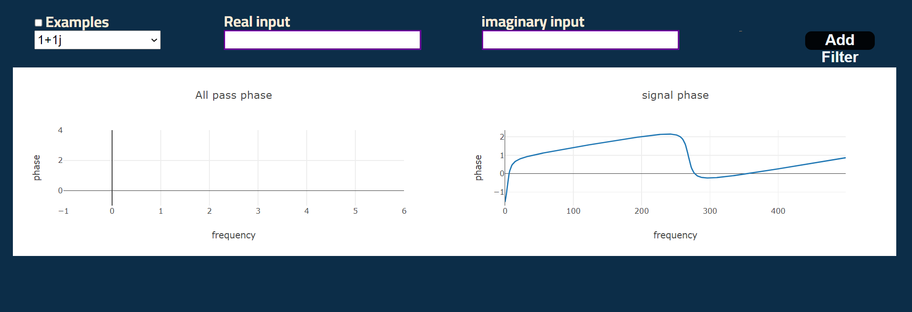

# Digital-Filter

## Table of contents:

- [Introduction](#introduction)
- [Project Features](#project-features)
- [Project Structure](#project-structure)
- [How to Run The Project](#run-the-project)
- [Team](#team)

### Introduction
This website provide the user to understand more about digital filters and how zeros and poles affect its formation.
*First: The components*
>
    1. Magnitude
    2. Phase
>
*Second: The Functionality*
>
    1. Choose Digital Filter: It provides the user to choose the zeros and poles
    2. Apply the Filter on a signal: It provides the signal before and after filter usage
    3. Correction of phase: provide the user to choose a specific all pass filter to correct the phase
>
<!-- *Third: The Website Options:*
>
    * Circle selector
    * Rectangle selector
    * Delete to upload new Images
    * Choose Selected
    * choose outer part of the selected region
> -->

### Project Features
1. INTERFACE

2. LPF Option

3. Low Pass on input signal

4. Low Pass on ECG

5. HPF Option

6. High Pass on input signal

7. High Pass on ECG

8. Export filter as CSV

9. Correct Phase Option




### Project Structure
The Web Application is built using:

[](https://skillicons.dev)

- Frontend:
  - HTML
  - CSS
  - JavaScript
  - Ajax
- Backend framework:
  - Flask (Python)
  
The Frontend main function to set the structure of the page and determine the indices of cropper and mange
the user interface while the backend function is to do on images operations like resizing,
applying  Fourier transform,  cutting, combining & reconstructing images.

```
main
├─ Notebooks
├─ static (JS & CSS files)
│  ├─  css
│  ├─  imgs
│  └─  js
├─ templates (HTML files)
├─ IMAGE.py (Back-End Class)
├─ PROCESSING.py (Back-End Class)
├─ app.py (Back-End Server)
└─ README.md
```

### Run the Project

1. Install Python3 in your computer

```
Download it from www.python.org/downloads/
```

2. Install the following packages
```
pip install numpy
```
```
pip install Flask
```
```
pip install os
```
```
pip install jsonify
```
```
pip install opencv-python
```


3. Open Project Terminal & Run

```
pip install -r requirments.txt
```

4. Start Server by Running

```
python app.py
```

5. Visit http://127.0.0.1:5000 

### Team

First Semester - Biomedical Digital Signal Processing (SBE3110) class project created by:

| Team Members' Names                                  | Section | B.N. |
| ---------------------------------------------------- | :-----: | :--: |
| [Dina Hussam](https://github.com/Dinahussam)         |    1    |  28  |
| [Sama Mostafa](https://github.com/SamaMostafa1)       |    1    |  44  |
| [Mohamed Salah](https://github.com/Ms850446) |    2    |  19  |
| [Yousr Ashraf](https://github.com/YousrHejy)       |    2    |  54  |

### Submitted to:

- Dr. Tamer Basha & Eng. Abdullah Darwish
  All rights reserved © 2023 to Team 2 - Systems & Biomedical Engineering, Cairo University (Class 2024)

    
